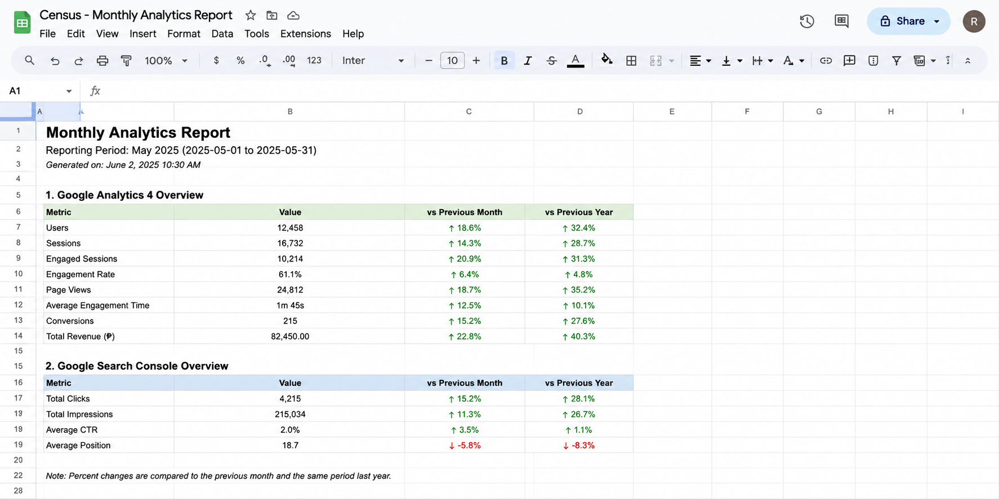

<div align="center">

# GA4 + Search Console → Google Sheets

### Automated Monthly Analytics Reporting Pipeline

<p>
  <strong>Collect. Process. Report.</strong><br>
  Automatically pull Google Analytics 4 and Google Search Console data, process key performance metrics, and organize everything into Google Sheets.
</p>

<p>
  
  
  
  
  
</p>

<p>
  <strong>Automated monthly reporting with minimal manual work.</strong>
</p>

<p>
  Built by <strong>Ralph Joseph San Jose</strong><br>
  <a href="https://github.com/ralphjosephsanjose2373-ops">GitHub</a> ·
  <a href="https://www.facebook.com/ralph2373">Facebook</a>
</p>

</div>


<p align="center">
  
</p>

## Overview

This pipeline automatically collects key performance metrics from **Google Analytics 4** and **Google Search Console** every month and appends them as a clean, formatted row in a Google Sheet.

It was built for teams that need consistent monthly reporting without the manual export → copy → paste cycle.

### What happens on every run

1. Determines the target month (previous calendar month by default, or any month you specify)
2. Pulls core GA4 metrics + channel breakdowns + selected custom events
3. Pulls Search Console clicks, impressions, CTR and average position
4. Checks for an existing row for that month (duplicate-safe)
5. Creates a professional header row (bold + frozen) if the sheet is empty
6. Appends the new data row and formats CTR as a percentage
7. Logs the full process and optionally notifies you on failure (Slack / email)

---

## Features

| # | Capability | Description |
|:---:|:---|:---|
| **01** | **Automated reporting** | GA4 + Search Console → Google Sheets |
| **02** | **Duplicate protection** | Prevents existing months from being written twice |
| **03** | **Dry-run mode** | Preview changes before writing to the sheet |
| **04** | **Modular architecture** | Clean separation of APIs, processing, and output |
| **05** | **Failure notifications** | Optional Slack or email alerts |
| **06** | **Flexible periods** | Previous month or any `YYYY-MM` period |
| **07** | **Reliable execution** | Logging, retries, validation, and `.env` configuration |
---

## Tech Stack

| # | Technology | Role |
|:---:|:---|:---|
| **01** | **Python 3.10+** | Core runtime and application logic |
| **02** | **Google Analytics Data API** | Retrieve GA4 metrics and dimensions |
| **03** | **Google Search Console API** | Retrieve search performance data |
| **04** | **Google Sheets API** | Write and format reporting data |
| **05** | **Google Service Account** | Non-interactive authentication |
| **06** | **python-dotenv** | Environment and configuration management |
| **07** | **requests** | Optional webhook notifications |

---

## Prerequisites

Before running the pipeline, make sure you have:

| Requirement | Details |
|:---|:---|
| **Google Account** | Access to the required GA4 property, Search Console property, and Google Sheet |
| **Python** | Version **3.10 or newer** |
| **Google Cloud Project** | A project with the required Google APIs enabled |
| **Service Account** | Credentials with access to the required Google services |
| **Terminal Access** | Ability to run Python and package installation commands |

### Google Services

The Google account or service account used by the pipeline must have access to:

- **Google Analytics 4** property
- **Google Search Console** property
- **Google Sheets** destination

## Google Cloud Setup (One-time)

These steps only need to be completed once. The same service account can be reused every month.

### 1. Create a Google Cloud project

1. Go to the [Google Cloud Console](https://console.cloud.google.com/)
2. Click the project dropdown → **New Project**
3. Name it clearly (e.g. `GA4-Sheets-Reporter`)
4. Click **Create** and ensure the new project is selected

### 2. Enable required APIs

Enable the following APIs in **APIs & Services → Library**:

- [Google Analytics Data API](https://console.cloud.google.com/apis/library/analyticsdata.googleapis.com)
- [Google Sheets API](https://console.cloud.google.com/apis/library/sheets.googleapis.com)
- [Google Search Console API](https://console.cloud.google.com/apis/library/searchconsole.googleapis.com)

### 3. Create a service account

1. Navigate to **IAM & Admin → Service Accounts**
2. Click **+ Create Service Account**
3. Name it (e.g. `ga4-sheets-reporter`)
4. Click **Create and Continue** → skip roles → **Done**

### 4. Create and download a JSON key

1. Open the service account → **Keys** tab
2. **Add Key → Create new key → JSON**
3. Store the downloaded file securely and note its absolute path
4. Treat this file like a password

> **Note:** Some organizations restrict service-account key creation. Contact your administrator if you encounter an error.

### 5. Grant access in Google Analytics 4

1. Open [Google Analytics](https://analytics.google.com/) → select the property
2. **Admin** → **Property access management**
3. **+ → Add users**
4. Paste the service account email (`...@....iam.gserviceaccount.com`)
5. Role: **Viewer**
6. Click **Add**

### 6. Share the Google Sheet

1. Open (or create) the destination Google Sheet
2. Click **Share** and paste the service account email
3. Permission: **Editor**
4. Note the **Spreadsheet ID** (the long string between `/d/` and `/edit` in the URL)

### 7. Grant access in Search Console

1. Open [Google Search Console](https://search.google.com/search-console)
2. Select the property → **Settings → Users and permissions**
3. **Add user** → paste the service account email
4. Permission: **Full** (or the minimum required to read Search Analytics)

---

## Local Setup

```bash
# Clone or extract the project
git clone <repository-url>
cd ga4_sheets_reporter

# Create and activate a virtual environment
python3 -m venv .venv
source .venv/bin/activate          # macOS / Linux
# .venv\Scripts\activate           # Windows

# Install dependencies
pip install -r requirements.txt

# Configure environment
cp .env.example .env
```

Edit `.env` with your real values:

```env
# Required
SERVICE_ACCOUNT_FILE=/absolute/path/to/service-account.json
SHEET_ID=1ABc-dEFGhI-Jkl34--mNoPQ
SHEET_NAME=2024
GA4_PROPERTY_ID=properties/123456789
SITE_URL=https://www.example.com/

# Optional
LOG_FILE=data_integration.log
SLACK_WEBHOOK_URL=
SMTP_HOST=
SMTP_PORT=587
SMTP_USER=
SMTP_PASSWORD=
NOTIFY_EMAIL_TO=
```

**Important**

- `SERVICE_ACCOUNT_FILE` must be an **absolute path**
- `GA4_PROPERTY_ID` must start with `properties/`
- `SITE_URL` must match the exact URL registered in Search Console (including protocol and trailing slash if applicable)
- Never commit `.env` or the JSON key (both are listed in `.gitignore`)

---

## Usage

Make sure the virtual environment is activated and you are in the project root.

### Normal run (previous calendar month)

```bash
python main.py
```

### Dry-run (recommended for first test)

```bash
python main.py --dry-run
```

Fetches data and prints exactly what would be written — **no changes** are made to the sheet.

### Specific month

```bash
python main.py --month 2025-03
python main.py --month 2025-03 --dry-run
```

Useful for back-filling or re-processing historical data.

---

## Google Sheet Output

When the sheet is empty the pipeline automatically creates this header row (bold + frozen):

| Month | Users | New Users | Events | Avg Engagement (mm:ss) | Eng. Sessions – Organic Social | Eng. Sessions – Direct | Eng. Sessions – Organic Search | Eng. Sessions – Referral | Users – spent ≥2 min | Users – Bli medlem click | GSC Clicks | GSC Impressions | GSC CTR | GSC Avg Position |
|-------|-------|-----------|--------|------------------------|--------------------------------|------------------------|--------------------------------|--------------------------|----------------------|--------------------------|------------|-----------------|---------|------------------|

- One new row is appended each successful monthly run
- The **CTR** column is automatically formatted as a percentage with one decimal place (e.g. `3.2%`)

<!-- Optional: replace with a real screenshot of the resulting sheet -->
<p align="center">
  
</p>

---

## Scheduling

### Windows Task Scheduler

1. Open **Task Scheduler** → **Create Basic Task**
2. Name: `Monthly GA4 Sheets Report`
3. Trigger: **Monthly** → day 2 or 3 (gives Google time to finalize data)
4. Action: **Start a program**
5. Program: full path to the virtualenv Python executable  
   Example: `C:\Users\YourName\projects\ga4_sheets_reporter\.venv\Scripts\python.exe`
6. Arguments: `main.py`
7. Start in: full path to the project folder

### Linux / macOS (cron)

```bash
crontab -e
```

Add (runs at 06:00 on the 2nd of every month):

```cron
0 6 2 * * cd /full/path/to/ga4_sheets_reporter && /full/path/to/ga4_sheets_reporter/.venv/bin/python main.py >> /full/path/to/ga4_sheets_reporter/cron.log 2>&1
```

### GitHub Actions (optional)

You can also run the pipeline via a scheduled GitHub Actions workflow using the service-account JSON stored as a repository secret. Contact the maintainer if you would like a ready-made workflow file.

---

## Project Structure

```
ga4_sheets_reporter/
├── main.py                 # Entry point, CLI, orchestration
├── config.py               # Environment loading + constants (channels, events, headers)
├── models.py               # Data classes (GA4Data, SearchConsoleData)
├── auth.py                 # Service-account credential loading
├── ga4.py                  # Google Analytics 4 API logic
├── search_console.py       # Search Console API logic
├── sheets.py               # Google Sheets read / write / formatting
├── utils.py                # Date helpers, retry decorator, notifications
├── requirements.txt
├── .env.example
├── .gitignore
└── README.md
```

The modular design keeps concerns cleanly separated and makes the pipeline easy to test and extend.

---

## Extending the Pipeline

### Change tracked channels or custom events

Edit the lists in `config.py`:

```python
CHANNELS = [
    "Organic Social",
    "Direct",
    "Organic Search",
    "Referral",
]

CUSTOM_EVENTS = [
    "user_spent_2_minutes",
    "bli_medlem_klick",
]
```

Also update the `HEADERS` list in the same file and the `build_row()` function in `main.py` if needed.

### Add additional metrics

1. Request the metric in `ga4.py` or `search_console.py`
2. Store it in the corresponding data class (`models.py`)
3. Add a header in `config.py`
4. Include the value in `build_row()` inside `main.py`

### Enable failure notifications

Populate either (or both) of these sections in `.env`:

- `SLACK_WEBHOOK_URL` — Slack incoming webhook
- SMTP settings + `NOTIFY_EMAIL_TO` — email alerts

---

## Troubleshooting

| Symptom | Likely Cause | Solution |
|---------|--------------|----------|
| `Configuration errors: SERVICE_ACCOUNT_FILE not found` | Incorrect path in `.env` | Use the full absolute path to the JSON key |
| `403 Permission denied` on GA4 | Service account missing from GA4 property | Re-check step 5 in Google Cloud setup |
| `403` or empty data from Search Console | Missing permissions or incorrect `SITE_URL` | Verify Search Console access and exact URL format |
| `Sheet 'XXXX' not found` | Wrong `SHEET_NAME` | Confirm the exact tab name in the spreadsheet |
| Month is skipped | Row already exists | Delete the existing row if you want to re-write it |
| CTR shows as decimal instead of % | Formatting step failed | Re-run; the script applies percent formatting automatically |
| Works in dry-run but fails on write | Sheet not shared with Editor rights | Re-check step 6 in Google Cloud setup |

Logs are written to both the console and the file defined by `LOG_FILE` (default: `data_integration.log`). Always inspect the log when diagnosing issues.

---

## Security Notes

- The service-account JSON key grants access to your analytics and spreadsheet data — keep it private
- Never commit `.env` or the JSON key to version control
- Grant the service account the **minimum** permissions required:
  - Viewer on the GA4 property
  - Editor only on the specific Google Sheet
  - Appropriate level on Search Console
- Rotate the key periodically according to your security policy

---

## Support

If you encounter problems during setup or monthly runs, please include:

1. The exact command you executed
2. The full error message / relevant log excerpt
3. Confirmation that the service account has the correct permissions on GA4, Search Console, and the Sheet

---
<div align="center">

### Collect. Process. Report.

**GA4 + Search Console → Google Sheets**

<br>

<a href="https://github.com/ralphjosephsanjose2373-ops">
  
</a>
<a href="https://www.facebook.com/ralph2373">
  
</a>
<a href="LICENSE">
  
</a>

<br><br>

**Ralph Joseph San Jose**

</div>